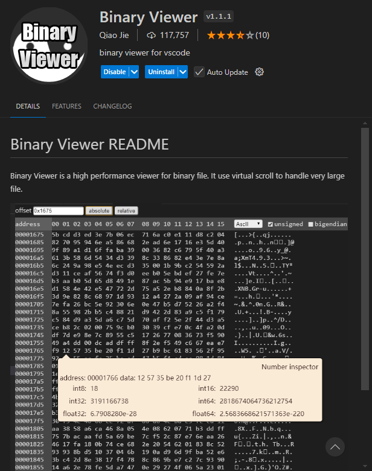

# Изучим как работает компиляция

1. **Предобработанный файл (`.i`)**:
   ```bash
   gcc -E main.c -o main.i
   ```
   Эта команда создаст файл `main.i`, который содержит исходный код после предобработки. В этом файле будут раскрыты все директивы препроцессора, такие как `#define`, и добавлены содержимое заголовочных файлов.

2. **Ассемблерный файл (`.s`)**:
   ```bash
   gcc -S main.c -o main.s
   ```
   Команда сгенерирует файл `main.s`, который содержит ассемблерные инструкции, соответствующие вашему коду на C. Это низкоуровневый код, предназначенный для непосредственного выполнения процессором.

3. **Объектный файл (`.o`)**:
   ```bash
   gcc -c main.c -o main.o
   ```
   Этот файл, `main.o`, является объектным файлом, содержащим машинный код. Он не предназначен для чтения человеком и является промежуточным результатом компиляции перед линковкой.

4. **Исполняемый файл**:
   ```bash
   gcc main.c -o main
   ```
   Эта команда создаст исполняемый файл с именем `main`, который можно запустить в командной строке.

Теперь, если вы выполнили команды, файлы `main.i`, `main.s`, и `main.o` будут содержать следующие данные:

### 1. **main.i**:
Здесь вы увидите полный исходный код с раскрытыми директивами препроцессора. Например, `#define LOWER 0` будет заменен на реальное значение. Также все файлы, подключенные с помощью `#include <stdio.h>`, будут вставлены в код.

### 2. **main.s**:
Это будет ассемблерный код, который выполняется на процессоре. Пример из него может выглядеть так (в зависимости от архитектуры вашей системы):
```assembly
movl $0, -4(%rbp)
cmpq $300, -4(%rbp)
jg .L2
```
Этот файл показывает, как высокоуровневый код на C преобразуется в низкоуровневые инструкции.

### 3. **main.o**:
Это будет скомпилированный машинный код в двоичном формате, который нельзя легко прочитать напрямую. Однако его можно исследовать с помощью утилиты `objdump`, например:
```bash
objdump -d main.o
```
Это позволит увидеть дизассемблированный код.

# VS Code bin viewer
QiaoJie.binary-viewer



# Магия

```
000023f0	00 00 00 00 00 00 00 00	00 00 00 00 00 00 00 00		................
00002400	54 72 61 6e 73 6c 61 74	69 6f 6e 20 46 3a 20 25		Translation F: %
00002410	33 64 20 7e 20 43 3a 20	25 36 2e 31 66 0a 00 00		3d ~ C: %6.1f...
00002420	72 1c c7 71 1c c7 e1 3f	00 00 00 00 00 00 00 00		r.q..?........
00002430	00 00 00 00 00 00 00 00	00 00 00 00 00 00 00 00		................
00002440	e0 15 00 40 01 00 00 00	00 00 00 00 00 00 00 00		..@............
00002450	00 00 00 00 00 00 00 00	00 00 00 00 00 00 00 00		................
00002460	00 a0 00 40 01 00 00 00	08 a0 00 40 01 00 00 00		...@.......@....
00002470	6c 70 00 40 01 00 00 00	38 90 00 40 01 00 00 00		lp.@....8..@....
00002480	00 00 00 00 00 00 00 00	00 00 00 00 00 00 00 00		................
00002490	00 00 00 00 00 00 00 00	00 00 00 00 00 00 00 00		................
000024a0	41 72 67 75 6d 65 6e 74	20 64 6f 6d 61 69 6e 20		Argument domain
000024b0	65 72 72 6f 72 20 28 44	4f 4d 41 49 4e 29 00 41		error (DOMAIN).A
000024c0	72 67 75 6d 65 6e 74 20	73 69 6e 67 75 6c 61 72		rgument singular
000024d0	69 74 79 20 28 53 49 47	4e 29 00 00 00 00 00 00		ity (SIGN)......
000024e0	4f 76 65 72 66 6c 6f 77	20 72 61 6e 67 65 20 65		Overflow range e
000024f0	72 72 6f 72 20 28 4f 56	45 52 46 4c 4f 57 29 00		rror (OVERFLOW).
00002500	50 61 72 74 69 61 6c 20	6c 6f 73 73 20 6f 66 20		Partial loss of
00002510	73 69 67 6e 69 66 69 63	61 6e 63 65 20 28 50 4c		significance (PL
00002520	4f 53 53 29 00 00 00 00	54 6f 74 61 6c 20 6c 6f		OSS)....Total lo
00002530	73 73 20 6f 66 20 73 69	67 6e 69 66 69 63 61 6e		ss of significan
00002540	63 65 20 28 54 4c 4f 53	53 29 00 00 00 00 00 00		ce (TLOSS)......
00002550	54 68 65 20 72 65 73 75	6c 74 20 69 73 20 74 6f		The result is to
00002560	6f 20 73 6d 61 6c 6c 20	74 6f 20 62 65 20 72 65		o small to be re
00002570	70 72 65 73 65 6e 74 65	64 20 28 55 4e 44 45 52		presented (UNDER
00002580	46 4c 4f 57 29 00 55 6e	6b 6e 6f 77 6e 20 65 72		FLOW).Unknown er
00002590	72 6f 72 00 00 00 00 00	5f 6d 61 74 68 65 72 72		ror....._matherr
000025a0	28 29 3a 20 25 73 20 69	6e 20 25 73 28 25 67 2c		(): %s in %s(%g,
000025b0	20 25 67 29 20 20 28 72	65 74 76 61 6c 3d 25 67		%g) (retval=%g
000025c0	29 0a 00 00 a8 d5 ff ff	5c d5 ff ff f4 d4 ff ff		).......\.......
000025d0	7c d5 ff ff 8c d5 ff ff	9c d5 ff ff 6c d5 ff ff		|...........l...
```