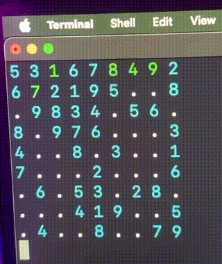

# Техническое задание для лабораторной работы: Реализация игры Судоку на языке C

## Цель работы

- **Разработать программу на чистом языке C**, которая реализует игру Судоку в два этапа:
  1. **Режим решения пользователем**: предоставить возможность пользователю самостоятельно решать Судоку.
  2. **Автоматический подбор (брутфорс)**: реализовать автоматическое решение Судоку методом перебора, с визуализацией процесса (небольшие паузы перед заменой символа).

## Требования к программе

### Общие требования

- **Язык реализации**: чистый C (не использовать C++).
- **Динамическая размерность поля**: поддержка полей размером 4x4, 6x6, 9x9.
- **Выбор размерности поля**: осуществлять через псевдоним (typedef).
- **Использование указателей**: работать с массивами через нотацию указателей `*()` вместо `[]`.
- **Управление функционалом бота**: включение автоматического решения (брутфорса) через директиву препроцессора `#ifndef`.

### Функциональные требования

#### 1. Режим решения пользователем

- **Инициализация поля**: создать пустое или частично заполненное поле Судоку выбранной размерности.
- **Ввод данных пользователем**:
  - Выбр ячейки осуществляется через нажатие WASD набора клавиш.
  - При выборе пустой ячейки отображать ее как `[ ]`.
  - Пользователь может вводить числа в пустые ячейки.
- **Отображение поля**:
  - Использовать пробелы в качестве разделителей между числами.
  - Пустые ячейки отображать как точки `.`.
  - При выборе ячейки для ввода числа отображать ее как `[ ]`.
- **Примеры вывода в консоль**:

  ```
  1 4 . 6 . 7 9 8 2
  2 . 7 . 5 8 6 . 4
  . 5 8 2 4 . 1 7 .
  ```

  При выборе ячейки для ввода числа (последовательно нажимем ->):

  ```
  1 4[.]6 . 7 9 8 2
  1 4 .[6]. 7 9 8 2
  1 4 . 6[.]7 9 8 2
  1 4 . 6 .[7]9 8 2
  ```

#### 2. Автоматический подбор (брутфорс)

- **Алгоритм решения**: реализовать рекурсивный алгоритм с возвратом (backtracking).
- **Визуализация процесса**:
  - Перед заменой каждого символа делать небольшую паузу.
  - Обновлять отображение поля после каждой итерации с учетом пауз.
- **Пауза**: реализовать с помощью функции `sleep()` или эквивалентной.

### Технические требования

- **Динамическое выделение памяти**: использовать динамическое выделение памяти для хранения игрового поля.
- **Нотация указателей**: при обращении к элементам массива использовать нотацию `*()` вместо `[]`.
  - Пример: вместо `array[i][j]` использовать `*(*(array + i) + j)`.
- **Псевдонимы (typedef)**: использовать `typedef` для определения типа данных, соответствующего размерности поля.
- **Препроцессорная директива**: использовать `#ifndef` для включения или исключения кода, отвечающего за автоматическое решение.

### Пользовательский интерфейс

- **Консольный интерфейс**: программа должна работать в консоли без графического интерфейса.
- **Выбор размерности**: при запуске программы пользователю предлагается выбрать размерность поля (4x4, 6x6, 9x9).
- **Интерактивность**: программа должна быть удобной и понятной для пользователя.
- **Сообщения об ошибках**: при некорректном вводе пользователь должен получать понятные сообщения об ошибках.
- **Формат отображения поля**:
  - Числа разделяются пробелами.
  - Пустые ячейки отображаются как точки `.`.
  - При выборе ячейки для ввода числа, пустая ячейка отображается как `[ ]`.

## Примеры работы брутфорса



## Правила сдачи работы

- **Загрузка на GitHub**:
  - Исходный код программы должен быть загружен в репозиторий на GitHub.
- **README.md**:
  - Добавить файл `README.md` с описанием программы.
  - Включить инструкции по сборке и запуску программы.
  - Добавить GIF-файл, демонстрирующий работу программы.
- **Оценка работы**:
  - **5/10 баллов**: за реализацию первой части (режим решения пользователем).
  - **10/10 баллов**: за полное решение, включающее автоматический подбор (брутфорс).
- **Примеры работы**:
  - Добавить примеры вывода программы в консоли.
  - Включить скриншоты или текстовые файлы с примером работы программы.

## Сдача работы

- **Исходный код программы**: файлы с расширением `.c` и `.h`.
- **README.md**:
  - Описание программы.
  - Инструкции по сборке и запуску.
  - GIF-файл работы программы.
- **Примеры работы**: скриншоты или текстовые файлы с примером вывода программы.
- **Документация**: добавить документацию по коду и использованным алгоритмам.

## Критерии оценки

- **Соответствие программы требованиям задания**.
- **Корректность работы** в обоих режимах (решение пользователем и автоматический подбор).
- **Использование указателей** и нотации `*()` вместо `[]`.
- **Качество кода**: структурированность, комментарии, соблюдение стандартов кодирования.
- **Наличие пауз и визуализации процесса** при автоматическом решении.
- **Реализация выбора размерности** через `typedef` и динамическое выделение памяти.
- **Оформление**: наличие `README.md` с инструкциями и GIF-файла с демонстрацией работы.

---

**Примечание**: Убедитесь, что программа корректно освобождает всю выделенную динамическую память во избежание утечек памяти.

---

### Небольшая подсказка

```C
#include <stdio.h>
#include <unistd.h>

#define SIZE 5

void print_matrix(char matrix[SIZE][SIZE]) {
    printf("\033[H");
    for (int i = 0; i < SIZE; i++) {
        for (int j = 0; j < SIZE; j++) {
            printf("%c ", matrix[i][j]);
        }
        printf("\n");
    }
    fflush(stdout);
}

void set_matrix_position(int row, int col) {
    printf("\033[%d;%dH", row + 1, (col + 1) * 2 - 1 );
}

int main() {
    char matrix[SIZE][SIZE] = {
        {'A', 'B', 'C', 'D', 'E'},
        {'F', 'G', 'H', 'I', 'J'},
        {'K', 'L', 'M', 'N', 'O'},
        {'P', 'Q', 'R', 'S', 'T'},
        {'U', 'V', 'W', 'X', 'Y'}
    };

    print_matrix(matrix);
    sleep(2);

    for (int i = 0; i < SIZE; i++) {
        for (int j = 0; j < SIZE; j++) {
            matrix[i][j] = '0';
            set_matrix_position(i, j);
            printf("%c", matrix[i][j]);
            fflush(stdout);
            sleep(1);
        }
    }

    return 0;
}
```