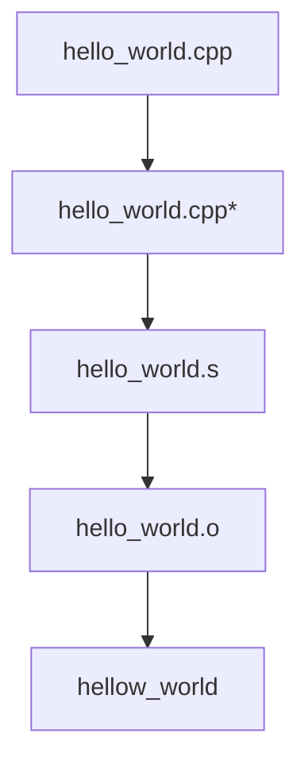

```
# Get preprocess file
g++ -E hello_world.cpp > hello_world.cpp_prep

# Get compiled code
g++ -S hello_world.cpp

# Get compiled and accembled code
g++ -c hello_world.cpp

# Get final runable file
g++ hello_world.cpp -o hello_world

# Run
./hellow_world
```

